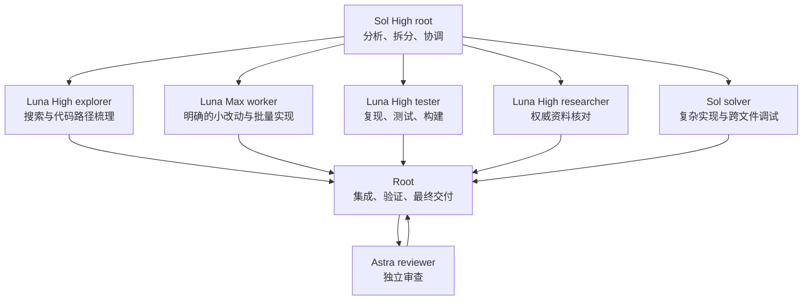

# Codex：Sol + Luna + Astra 多模型编排

这套配置把复杂开发任务拆成多个职责层：

- **Sol root**：分析、拆分、协调、集成和最终验收
- **Luna High**：搜索、研究、测试和构建
- **Luna Max worker**：明确的小功能和批量修改
- **Sol solver**：复杂实现、跨文件重构和疑难调试
- **Astra reviewer**：独立检查正确性、安全性、回归和测试遗漏

仓库改编自 [codex-astra-luna-orchestrator](https://github.com/donvito/codex-astra-luna-orchestrator)，只保留通用 Pro 流程。所有角色均使用 Codex 原生 OpenAI provider，不需要额外 API key、本地模型适配器或模型目录。

## 分工拓扑



## Profiles

| Profile | 根代理 | 日常执行 | 复杂实现 | 独立审查 | 最大并发子任务 |
| --- | --- | --- | --- | --- | ---: |
| `pro` | GPT-5.6 Sol / high | GPT-5.6 Luna / high；worker / max | GPT-5.6 Sol / high | GPT-6 Astra / low | 4 |
| `pro-max-2-subagents` | 同 `pro` | 同 `pro` | 同 `pro` | 同 `pro` | 2 |

第二个 profile 只降低并发数，其他配置完全相同。

## 前置条件

- Codex CLI、Codex 桌面端或 IDE 扩展
- 当前 Codex 账户能够使用 Astra、Luna 和 Sol
- 已存在的目标项目；不能直接安装到本仓库自身

## 安装

Windows PowerShell：

```powershell
powershell -ExecutionPolicy Bypass -File .\setup.ps1
```

Linux/macOS：

```sh
./setup.sh
```

安装器会询问目标项目、profile，以及是否安装：

- `.codex/`：主配置和命名代理
- `.agents/`：`astra-orchestrator` 技能
- `AGENTS.md`：项目级持久编排规则

如果目标已有同名内容，安装器会列出覆盖范围并再次确认；未列出的文件不会被删除。

从旧版 DeepSeek 流程升级时，安装器会识别 `.codex/` 下六个已知的旧适配器文件，并在再次确认后删除。旧版若曾把 DeepSeek 规则追加到目标项目的 `AGENTS.md`，请在安装新规则后人工删除那段旧规则，避免与 Luna 路由冲突。

## 使用

在目标项目中直接启动 Codex。无需先启动任何适配器。

可显式调用技能：

```text
$astra-orchestrator

重构订单导出功能：
1. explorer 梳理现有路径；
2. worker 处理边界清晰的小改动；
3. solver 接跨模块核心重构；
4. tester 做回归验证；
5. reviewer 做独立终审。
```

## 路由原则

- 探索、研究和测试等日常工作交给 Luna High；明确的实现工作交给 Luna Max worker。
- 跨组件、强耦合、连续调试或非显然实现交给 Sol。
- 架构取舍、冲突解决和最终是否通过由 Sol High root 决定。
- reviewer 只报告问题，不和实现代理同时编辑同一文件。
- 不要为了形式机械创建所有角色；小任务由 root 直接完成。
- 只有预计明显超过 15 分钟的委派任务才创建 15 分钟 heartbeat。

## 配置摘要

日常探索、测试和研究角色：

```toml
model = "gpt-5.6-luna"
model_provider = "openai"
model_reasoning_effort = "high"
```

明确实现角色：

```toml
model = "gpt-5.6-luna"
model_provider = "openai"
model_reasoning_effort = "max"
```

复杂实现角色：

```toml
model = "gpt-5.6-sol"
model_provider = "openai"
model_reasoning_effort = "high"
```

## 验证

仓库测试需要 Python 3.11 或更高版本；这只是开发验证依赖，安装并运行工作流本身不需要 Python。

```powershell
python -m unittest discover -s tests -v
```

测试覆盖 profile TOML、角色路由、两个 profile 的一致性、安装器语法、旧适配器清理边界和 token usage 解析。

## 更多说明

- [完整分工与 heartbeat](guides/full-orchestration.md)
- [快速迭代](guides/fast-iteration.md)
- [复杂仓库任务](guides/complex-repo-work.md)
- [日常编码](guides/routine-coding.md)
- [用量统计](guides/token-usage.md)

## License

Apache-2.0，见 [LICENSE](LICENSE)。
